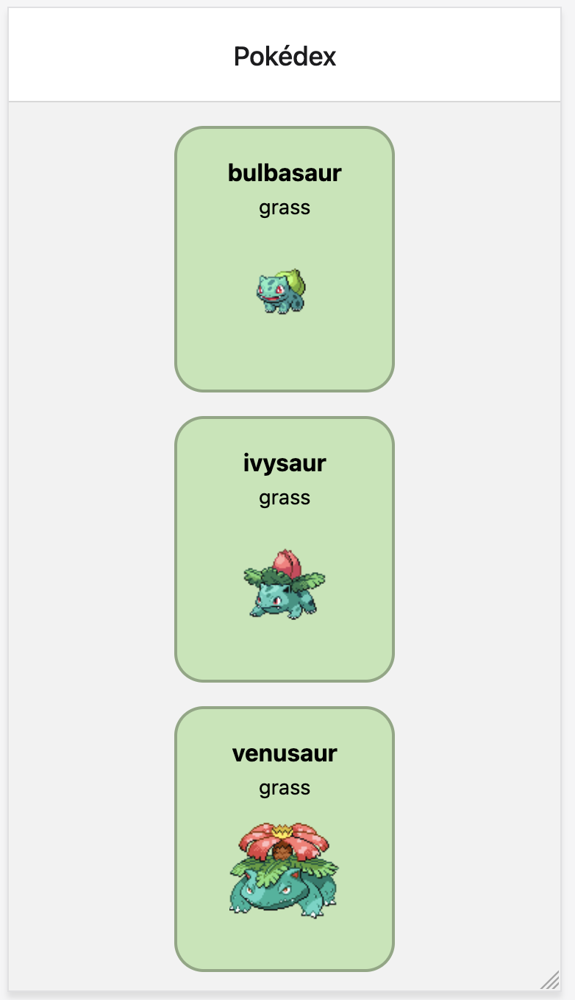
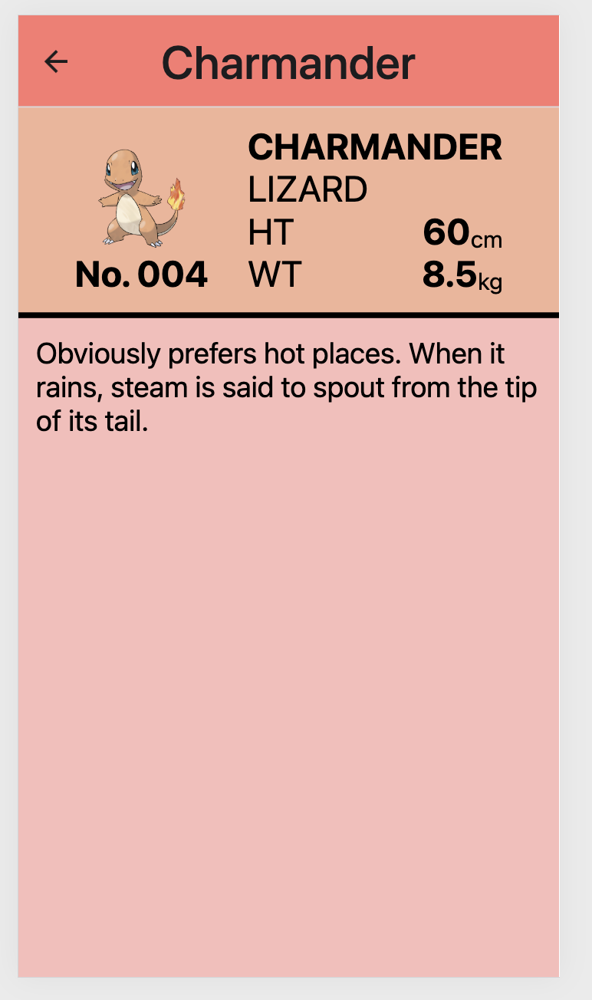
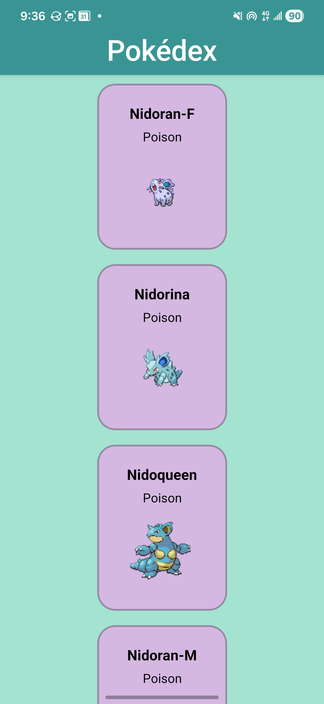
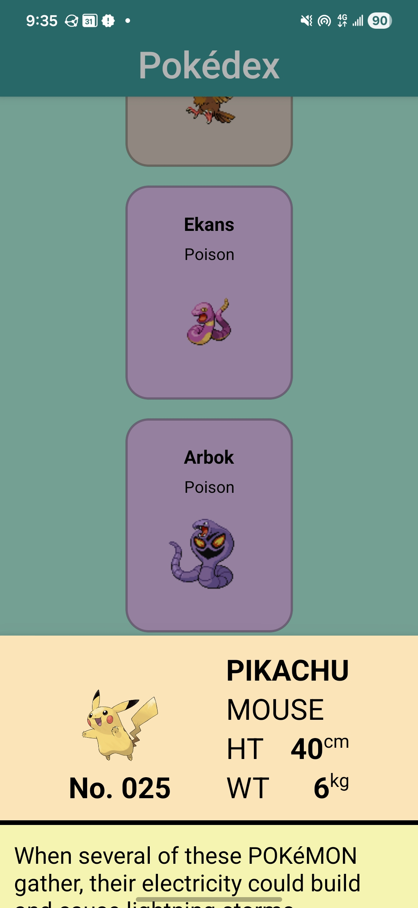
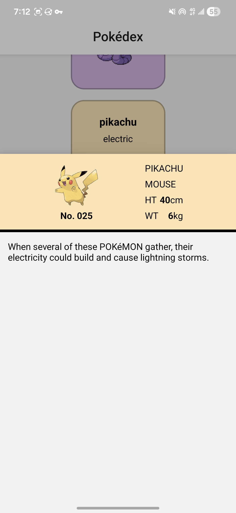

# Pokédex

## Table of Contents

- [Description](#description)
- **For End Users**
  - [Where to Download](#where-to-download-the-app)
  - [Usage and Screenshots](#usage-and-screenshots)
- **For Developers**
  - [Future Improvements](#future-improvements)
  - [Installation Instructions](#installation-instructions)
  - [Technologies Used](#technologies-used)
  - [Dependencies and Credits](#dependencies-and-credits)
  - [Project Structure](#project-structure)

## Description

This is a simple Pokédex of the original 151 Pokémon.

### Features

- Display a list of all 151 original Pokémon
- View Pokédex entries for each Pokémon by clicking on them
- Pulls Pokémon information from [PokéAPI](https://pokeapi.co)

## Where to Download the App

<a href="https://grounded-wanderer-pokedex.expo.app"></a>

<!-- ******** Add link ************
<a href="https://play.google.com/store/games"></a>
-->

<!-- ******* Need to get link to badge per: https://f-droid.org/docs/Badges/ ******
<a href="https://f-droid.org/packages/"></a>
-->

## Usage and Screenshots

### Screenshots of the Web App

<div>


</div>

### Screenshots of the Android App

<div>



</div>

You can view the Pokédex entry for each Pokémon by clicking on them.

## Future Improvements

- Improve general styling
- Add search function
  - Search by name or by number

## Installation Instructions

1. If you haven't already, [install Node.js and npm](https://www.theodinproject.com/lessons/foundations-installing-node-js)
   - Note that installing Node.js [also installs npm](https://www.theodinproject.com/lessons/foundations-installing-node-js#step-2-setting-the-node-version)
1. Fork this repo
1. In your copy of the repo click the green **Code** button and copy the URL
1. If you don't have an Expo account [sign up](https://expo.dev/signup) for one
1. Open your IDE
1. `cd PARENT_DIRECTORY_FOR_THIS_PROJECT`
1. `git clone COPIED_URL`
1. `cd PROJECT_FOLDER`
1. Run the following in your terminal
   ```bash
   npm init -y
   npm install
   ```
   ```bash
   eas login
   ```
1. ```bash react native
   npx expo start
   ```

   - If there are [issues](https://docs.expo.dev/get-started/start-developing/#having-problems) run this instead
     ```bash
     npx expo start --tunnel
     ```
   - `^` + `c` will end the process

### To build a production apk

1. ```bash
   code eas.json
   ```
1. ```bash
   {
    ...
    "build": {
      "apk": {
        "android": {
          "buildType": "apk"
        }
      },
   ...
   }
   ```
1. Then you can run the apk build profile
   ```
   eas build --platform android --profile apk
   ```

## Technologies Used

- <a href="https://developer.mozilla.org/en-US/docs/Web/CSS"> CSS</a>
- <a href="https://eslint.org/"> ESLint</a>
- <a href="https://expo.dev"> Expo </a>
- <a href="https://developer.mozilla.org/en-US/docs/Web/JavaScript"> JavaScript</a>
- <a href="https://reactnative.dev/"> React Native</a>
- <a href="https://www.typescriptlang.org/"> TypeScript</a>

### Development Tools

- <a href="https://code.visualstudio.com/"> VS Code</a>
- <a href="https://www.npmjs.com/"> npm</a>
- <a href="https://git-scm.com/"> Git</a>

### Hosting

- <a href="https://expo.dev/services/hosting"> EAS</a>
- <a href="https://github.com/"> Github</a>

## Dependencies and Credits

### Package Dependencies

- [@expo/vector-icons](https://www.npmjs.com/package/@expo/vector-icons)
- [@react-navigation/bottom-tabs](https://www.npmjs.com/package/@react-navigation/bottom-tabs)
- [@react-navigation/elements](https://www.npmjs.com/package/@react-navigation/elements)
- [@react-navigation/native](https://www.npmjs.com/package/@react-navigation/native)
- [expo](https://www.npmjs.com/package/expo)
- [expo-constants](https://www.npmjs.com/package/expo-constants)
- [expo-dev-client](https://www.npmjs.com/package/expo-dev-client)
- [expo-font](https://www.npmjs.com/package/expo-font)
- [expo-haptics](https://www.npmjs.com/package/expo-haptics)
- [expo-image](https://www.npmjs.com/package/expo-image)
- [expo-linking](https://www.npmjs.com/package/expo-linking)
- [expo-router](https://www.npmjs.com/package/expo-router)
- [expo-splash-screen](https://www.npmjs.com/package/expo-splash-screen)
- [expo-status-bar](https://www.npmjs.com/package/expo-status-bar)
- [expo-symbols](https://www.npmjs.com/package/expo-symbols)
- [expo-system-ui](https://www.npmjs.com/package/expo-system-ui)
- [expo-web-browser](https://www.npmjs.com/package/expo-web-browser)
- [react](https://www.npmjs.com/package/react)
- [react-dom](https://www.npmjs.com/package/react-dom)
- [react-native](https://www.npmjs.com/package/react-native)
- [react-native-gesture-handler](https://www.npmjs.com/package/react-native-gesture-handler)
- [react-native-reanimated](https://www.npmjs.com/package/react-native-reanimated)
- [react-native-safe-area-context](https://www.npmjs.com/package/react-native-safe-area-context)
- [react-native-screens](https://www.npmjs.com/package/react-native-screens)
- [react-native-web](https://www.npmjs.com/package/react-native-web)
- [react-native-worklets](https://www.npmjs.com/package/react-native-worklets)
- [@types/react](https://www.npmjs.com/package/@types/react)
- [typescript](https://www.npmjs.com/package/typescript)
- [eslint](https://www.npmjs.com/package/eslint)
- [eslint-config-expo](https://www.npmjs.com/package/eslint-config-expo)

### Other Credits

- [Devicion](https://devicon.dev/)
- [Skillicons](https://skillicons.dev/)
- [PokéAPI](https://pokeapi.co)

## Project Structure

```bash
├──.vscode
   ├──extensions.json
   └──settings.json
├──assets/                            # Compiled queries.js
   ├──icons/
      ├──adaptive-icon.png
      ├──favicon.png
      ├──icon.png
      ├──ios-dark.png
      ├──ios-light.png
      ├──ios-tinted.png
      ├──splash-icon-dark.png
      └──splash-icon-light.png
   └──images/
      ├──screenshot-android-pikachu-large-popup.jpg
      ├──screenshot-android-pikachu-small-popup.jpg
      ├──screenshot-android.jpg
      ├──screenshot-web-charmander.png
      └──screenshot-web.png
├──src/                               # Generated Prisma files
   ├──app/                            # Controller files
      ├──_layout.tsx                  # App pages
      ├──details.tsx
      └──index.tsx
   ├──components/                     # UI components
      └──pokemonCard.tsx
   └──utils/                          # Utility files
      ├──generateCardSize.ts
      ├──styles.ts
      └──types.ts
├──.gitignore
├──app.json
├──eas.json
├──eslint.config.js
├──LICENSE
├──package-lock.json
├──package.json
├──README.md
└──tsconfig.js
```
